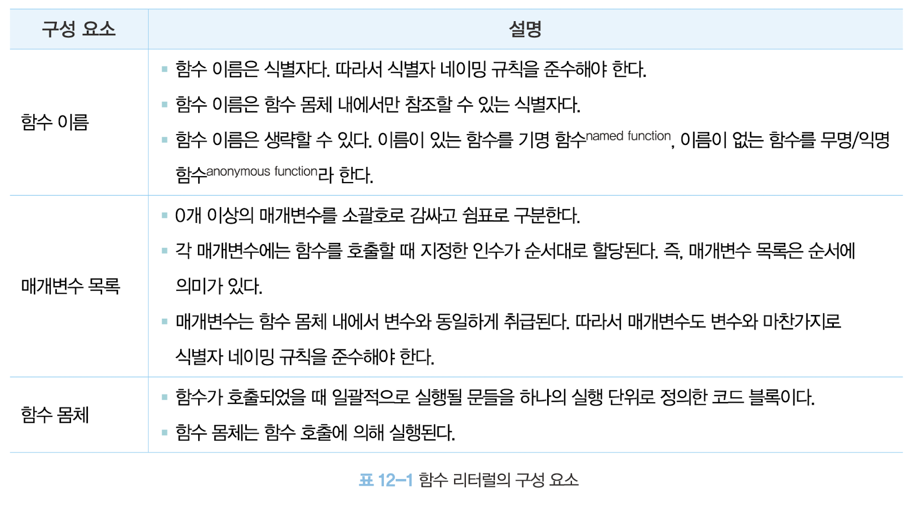
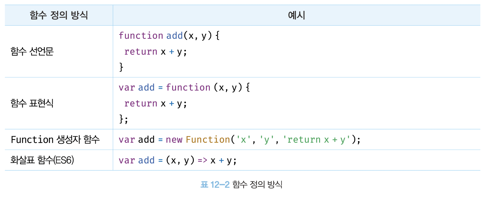

# 12장 함수

## 12.1 함수란?

프로그래밍 언어의 **함수는 일련의 과정을 문(statement)으로 구현하고 코드 블록으로 감싸서 하나의 실행 단위로 정의한 것이다.**

함수 내부로 입력을 전달받는 변수를 **매개변수**, 입력을 **인수**, 출력을 **반환값**이라 한다.

## 12.2 함수를 사용하는 이유

동일한 작업을 반복적으로 수행해야 한다면 같은 코드를 중복해서 여러 번 작성하는 것이 아니라 미리 정의된 함수를 재사용하는 것이 효율적이다. 함수는 몇 번이든 호출할 수 있으므로 **코드의 재사용**이라는 측면에서 매우 유용하다.

코드의 중복을 억제하고 재사용성을 높이는 함수는 **유지보수의 편의성**을 높이고 실수를 줄여 **코드의 신뢰성**을 높이는 효과가 있다.

적절한 함수 이름은 함수의 내부 코드를 이해하지 않고도 함수의 역할을 파악할 수 있게 돕는다. 이는 **코드의 가독성**을 향상시킨다.

코드는 동작하는 것만이 존재 목적은 아니다. 코드는 개발자를 위한 문서이기도 하다. 따라서 사람이 이해할 수 있는 코드, 즉 가독성이 좋은 코드가 좋은 코드다.

## 12.3 함수 리터럴

함수 리터럴의 구성 요소는 다음과 같다.

함수는 객체지만 일반 객체와는 다르다. **일반 객체는 호출할 수 없지만 함수는 호출할 수 있다.** 그리고 일반 객체에는 없는 함수 객체만의 고유한 프로퍼티를 갖는다.

## 12.4 함수 정의

