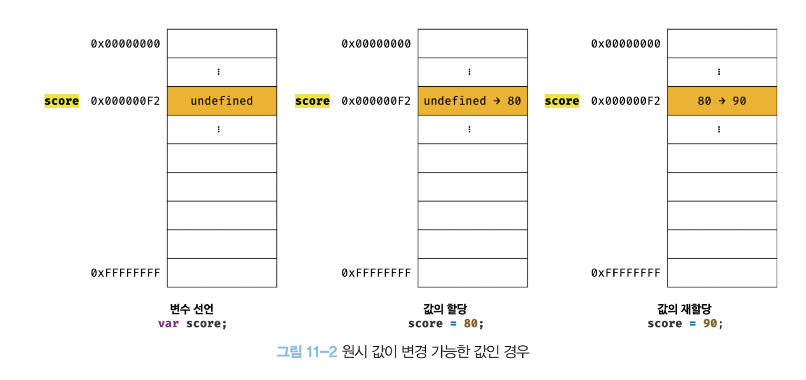
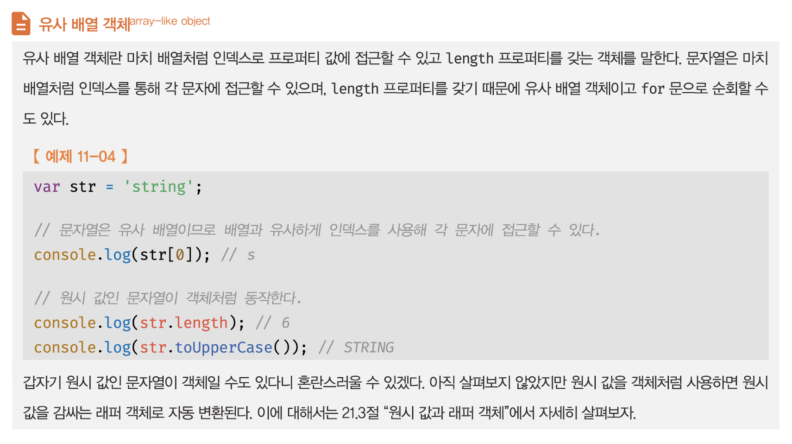
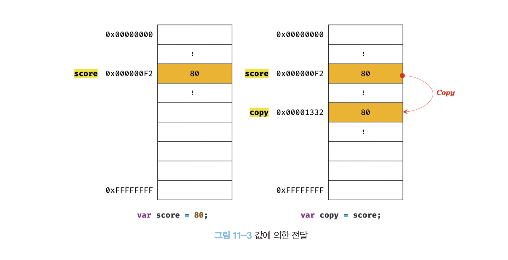
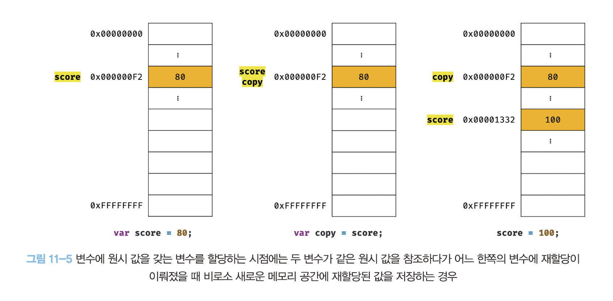
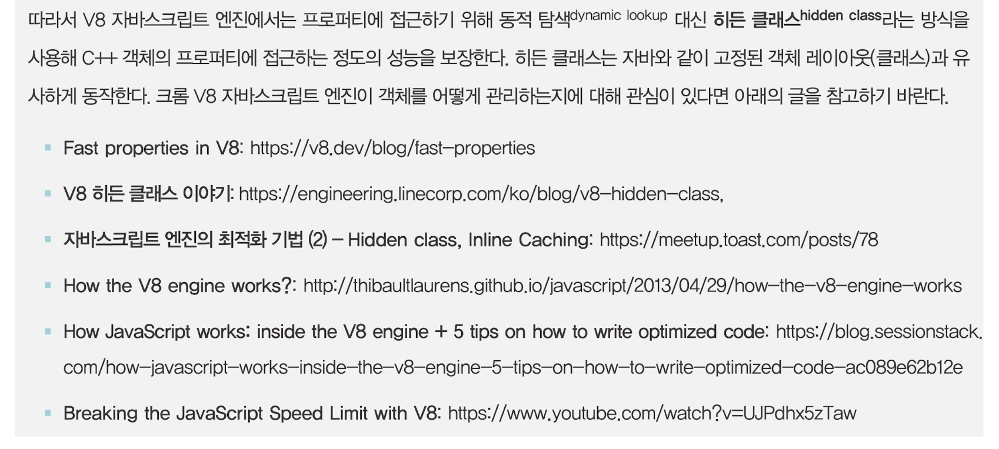
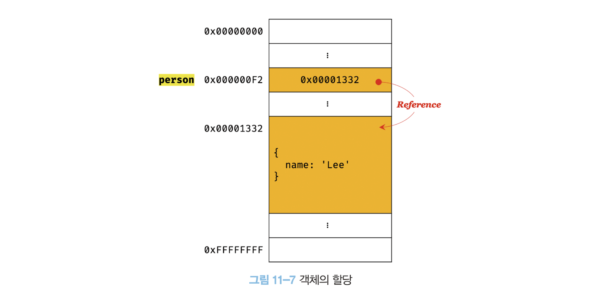
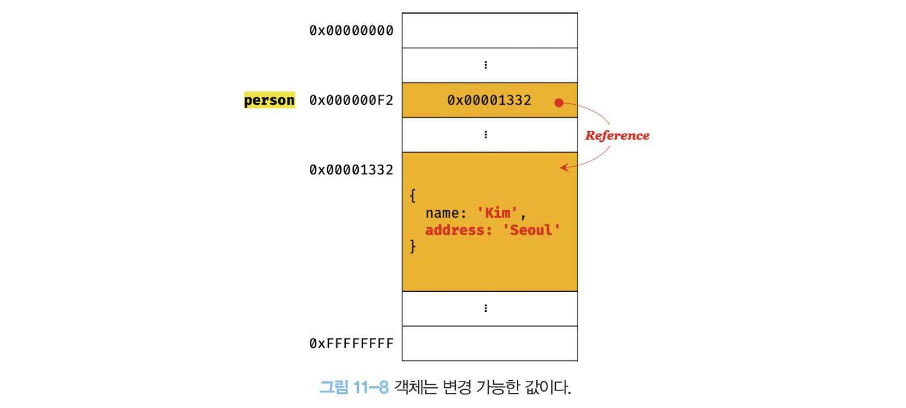
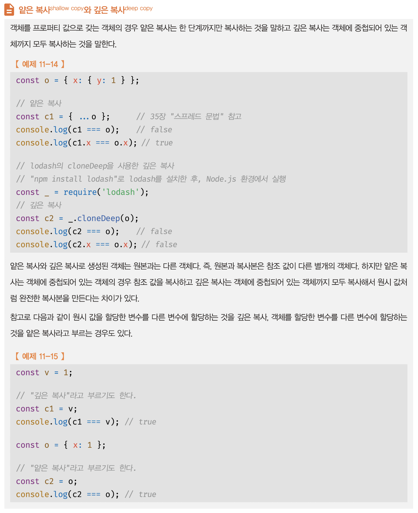
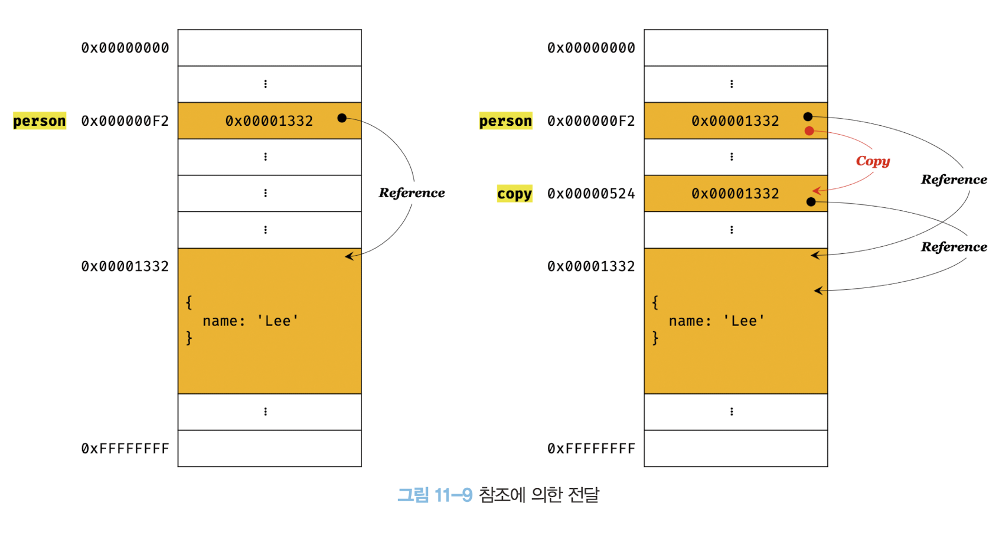

# 11장 원시 값과 객체의 비교

원시 타입과 객체 타입은 크게 세 가지 측면에서 다르다.

- **원시 타입의 값, 즉 원시 값은 변경 불가능한 값**이다. 이에 비해 **객체(참조) 타입의 값, 즉 객체는 변경 가능한 값**이다.
- **원시 값을 변수에 할당하면 변수(확보된 메모리 공간)에는 실제 값이 저장**된다. 이에 비해 **객체를 변수에 할당하면 변수(확보된 메모리 공간)에는 참조 값이 저장**된다.
- 원시 값을 갖는 변수를 다른 변수에 할당하면 원본의 **원시 값이 복사되어 전달**된다. 이를 **값에 의한 전달(pass by value)**이라 한다. 이에 비해 객체를 가리키는 변수를 다른 변수에 할당하면 원본의 **참조 값이 복사되어 전달**된다. 이를 **참조에 의한 전달(pass by reference)**이라 한다.

## 11.1 원시 값

### 11.1.1 변경 불가능한 값

**원시 타입의 값, 즉 원시 값은 변경 불가능한 값**이다. 다시 말해, 한번 생성된 원시 값은 읽기 전용(read only) 값으로서 변경할 수 없다.

변수는 하나의 값을 저장하기 위해 확보된 메모리 공간 자체 또는 그 메모리 공간을 식별하기 위해 붙인 이름이고, 값은 변수에 저장된 데이터로서 표현식이 평가되어 생성된 결과를 말한다. **변경 불가능하다는 것은 변수가 아니라 값에 대한 진술이다.**

"원시 값은 변경 불가능하다"는 말은 원시 값 자체를 변경할 수 없다는 것이지 변수 값을 변경할 수 없다는 것이 아니다. 변수는 언제든지 재할당을 통해 변수 값을 변경(교체)할 수 있다.

```js
// const 키워드를 사용해 선언한 변수는 재할당이 금지된다. 상수는 재할당이 금지된 변수일 뿐이다.
const o = {};

// const 키워드를 사용해 선언한 변수에 할당한 원시값(상수)은 변경할 수 없다.
// 하지만 const 키워드를 사용해 선언한 변수에 할당한 객체는 변경할 수 있다.
o.a = 1;
console.log(o); // {a: 1}
```

원시 값은 어떤 일이 있어도 불변한다. 이러한 원시 값의 특성은 데이터의 신뢰성을 보장한다.

원시 값을 할당한 변수에 새로운 원시 값을 재할당하면 메모리 공간에 저장되어 있는 재할당 이전의 원시 값을 변경하는 것이 아니라 새로운 메모리 공간을 확보하고 재할당한 원시 값을 저장한 후, 변수는 새롭게 재할당한 원시 값을 가리킨다. 이때 변수가 참조하던 메모리 공간의 주소가 바뀐다.


변수가 참조하던 메모리 공간의 주소가 변경된 이유는 변수에 할당된 원시 값이 변경 불가능한 값이기 때문이다. 만약 원시 값이 변경 가능한 값이라면 변수에 새로운 원시 값을 재할당했을 때 변수가 가리키던 메모리 공간의 주소를 바꿀 필요없이 원시 값 자체를 변경하면 그만이다. 만약 그렇다면 변수가 참조하던 메모리 공간의 주소는 바뀌지 않는다.



변수 값을 변경하기 위해 원시 값을 재할당하면 새로운 메모리 공간을 확보하고 재할당한 값을 저장한 후, 변수가 참조하던 메모리 공간의 주소를 변경한다. 값의 이러한 특성을 **불변성**이라 한다.

**불변성을 갖는 원시 값을 할당한 변수는 재할당 이외에 변수 값을 변경할 수 있는 방법이 없다.** 만약 재할당 이외에 원시 값인 변수 값을 변경할 수 있다면 예기치 않게 변수 값이 변경될 수 있다는 것을 의미한다. 이는 값의 변경, 즉 상태 변경을 추적하기 어렵게 만든다.

### 11.1.2 문자열과 불변성

자바스크립트는 개발자의 편의를 위해 원시 타입인 문자열 타입을 제공한다. 자바스크립트의 문자열은 원시 타입이며, 변경 불가능하다. 이것은 문자열이 생성된 이후에는 변경할 수 없음을 의미한다.

```js
var str = 'Hello';
str = 'world';
```

문자열의 한 문자를 변경해 보자. 문자열은 유사 배열 객체이면서 이터러블이므로 배열과 유사하게 각 문자에 접근할 수 있다.



```js
var str = 'string';

// 문자열은 유사 배열이므로 배열과 유사하게 인덱스를 사용해 각 문자에 접근할 수 있다.
// 하지만 문자열은 원시값이므로 변경할 수 없다. 이때 에러가 발생하지 않는다.
str[0] = 'S';

console.log(str); // string
```

`str[0] = 'S'`처럼 이미 생성된 문자열의 일부 문자를 변경해도 반영되지 않는다. 문자열은 변경 불가능한 값이기 때문이다.

그러나 변수에 새로운 문자열을 재할당하는 것은 물론 가능하다. 이는 기존 문자열을 변경하는 것이 아니라 새로운 문자열을 새롭게 할당하는 것이기 때문이다.

### 11.1.3 값에 의한 전달

```js
var score = 80;
var copy = score;

console.log(score); // 80
console.log(copy); // 80

score = 100;

console.log(score); // 100
console.log(copy); // ?
```

`score` 변수에 새로운 숫자 값 100을 재할당하면 `copy` 변수의 값은 어떻게 될까?

이 질문의 핵심은 "변수에 변수를 할당했을 때 무엇이 어떻게 전달되는가?"다. `copy = score`에서 `score`는 변수 값 80으로 평가되므로 `copy` 변수에도 80이 할당될 것이다. 이때 새로운 숫자 값 80이 생성되어 `copy` 변수에 할당된다.

이처럼 변수에 원시 값을 갖는 변수를 할당하면 할당받는 변수(`copy`)에는 할당되는 변수(`score`)의 원시 값이 복사되어 전달된다. 이를 **값에 의한 전달**이라 한다. 위 예제의 경우 `copy` 변수에 원시 값을 갖는 `score` 변수를 할당하면 할당받는 변수(`copy`)에는 할당되는 변수(`score`)의 원시 값 80이 복사되어 전달된다.

```js
var score = 80;

// copy 변수에는 score 변수의 값 80이 복사되어 할당된다.
var copy = score;

console.log(score, copy); // 80  80
console.log(score === copy); // true
```

**score 변수와 copy 변수의 값 80은 다른 메모리 공간에 저장된 별개의 값이다.**



이제 `score` 변수의 값을 변경해 보자.

```js
var score = 80;

// copy 변수에는 score 변수의 값 80이 복사되어 할당된다.
var copy = score;

console.log(score, copy); // 80  80
console.log(score === copy); // true

// score 변수와 copy 변수의 값은 다른 메모리 공간에 저장된 별개의 값이다.
// 따라서 score 변수의 값을 변경해도 copy 변수의 값에는 어떠한 영향도 주지 않는다.
score = 100;

console.log(score, copy); // 100  80
console.log(score === copy); // false
```

`score` 변수와 `copy` 변수의 값 80은 다른 메모리 공간에 저장된 별개의 값이라는 것에 주의하기 바란다. 따라서 `score` 변수의 값을 변경해도 `copy` 변수의 값에는 어떠한 영향도 주지 않는다.


위 그림에서는 변수에 원시 값을 갖는 변수를 할당하면 원시 값이 복사되는 것으로 표현했다. 하지만 변수에 원시 값을 갖는 변수를 할당하는 시점에는 두 변수가 같은 원시 값을 참조하다가 어느 한쪽의 변수에 재할당이 이뤄졌을 때 비로소 새로운 메모리 공간에 재할당된 값을 저장하도록 동작할 수도 있다. 참고로 파이썬은 이처럼 동작한다.



"값에 의한 전달"이라는 용어는 자바스크립트를 위한 용어가 아니므로 사실 오해가 있을 수도 있다. **엄격하게 표현하면 변수에는 값이 전달되는 것이 아니라 메모리 주소가 전달되기 때문이다. 이는 변수와 같은 식별자는 값이 아니라 메모리 주소를 기억하고 있기 때문이다.**

식별자는 어떤 값을 구별해서 식별해낼 수 있는 고유한 이름이다. 값은 메모리 공간에 저장되어 있다. 따라서 식별자는 메모리 공간에 저장되어 있는 어떤 값을 구별해서 식별해낼 수 있어야 하므로 변수와 같은 식별자는 값이 아니라 메모리 주소를 기억하고 있다.

식별자로 값을 구별해서 식별한다는 것은 식별자가 기억하고 있는 메모리 주소를 통해 메모리 공간에 저장된 값에 접근할 수 있다는 것을 의미한다. 즉, 식별자는 메모리 주소에 붙인 이름이라고 할 수 있다.

```js
var copy = score;
```

위 예제의 경우 `score`는 식별자 표현식으로서 숫자 값 80으로 평가된다. 이때 두 가지 평가 방식이 가능하다.

1. 새로운 80을 생성(복사)해서 메모리 주소를 전달(그림 11-4)하는 방식. 이 방식은 할당 시점에 두 변수가 기억하는 메모리 주소가 다르다.
2. `score`의 변수값 80의 메모리 주소를 그대로 전달(그림 11-5)하는 방식. 이 방식은 할당 시점에 두 변수가 기억하는 메모리 주소가 같다.

**이처럼 "값의 의한 전달"도 사실은 값을 전달하는 것이 아니라 메모리 주소를 전달한다. 단, 전달된 메모리 주소를 통해 메모리 공간에 접근하면 값을 참조할 수 있다.**

중요한 것은 변수에 원시 값을 갖는 변수를 할당하면 변수 할당 시점이든, 두 변수 중 어느 하나의 변수에 값을 재할당하는 시점이든 **결국은 두 변수의 원시 값은 서로 다른 메모리 공간에 저장된 별개의 값이 되어 어느 한쪽에서 재할당을 통해 값을 변경하더라도 서로 간섭할 수 없다**는 것이다.

## 11.2 객체

객체는 프로퍼티의 개수가 정해져 있지 않으며, 동적으로 추가되고 삭제할 수 있다. 또한 프로퍼티의 값에도 제약이 없다. 따라서 객체는 원시 값과 같이 확보해야 할 메모리 공간의 크기를 사전에 정해 둘 수 없다.

객체는 복합적인 자료구조이므로 객체를 관리하는 방식이 원시 값과 비교해서 복잡하고 구현 방식도 브라우저 제조사마다 다를 수 있다. 원시 값은 상대적으로 적은 메모리를 소비하지만 객체는 경우에 따라 크기가 매우 클 수도 있다. 객체를 생성하고 프로퍼티에 접근하는 것도 원시 값과 비교할 때 비용이 많이 드는 일이다.




### 11.2.1 변경 가능한 값

**객체(참조) 타입의 값, 즉 객체는 변경 가능한 값**이다.

```js
var person = {
  name: 'Lee',
};
```

객체를 할당한 변수가 기억하는 메모리 주소를 통해 메모리 공간에 접근하면 **참조 값**에 접근할 수 있다. 참조 값은 생성된 객체가 저장된 메모리 공간의 주소, 그 자체다.

다음 그림을 보면 객체를 할당한 변수에는 생성된 객체가 실제로 저장된 메모리 공간의 주소가 저장되어 있다. 이 값을 참조 값이라고 한다. 변수는 이 참조 값을 통해 객체에 접근할 수 있다.



```js
// 할당이 이뤄지는 시점에 객체 리터럴이 해석되고, 그 결과 객체가 생성된다.
var person = {
  name: 'Lee',
};

// person 변수에 저장되어 있는 참조값으로 실제 객체에 접근해서 그 객체를 반환한다.
console.log(person); // {name: "Lee"}
```

**원시 값은 변경 불가능한 값이므로 원시 값을 갖는 변수의 값을 변경하려면 재할당 외에는 방법이 없다. 하지만 객체는 변경 가능한 값이다. 따라서 객체를 할당한 변수는 재할당 없이 객체를 직접 변경할 수 있다. 즉, 재할당 없이 프로퍼티를 동적으로 추가할 수도 있고 프로퍼티 값을 갱신할 수도 있으며 프로퍼티 자체를 삭제할 수도 있다.**

```js
var person = {
  name: 'Lee',
};

// 프로퍼티 값 갱신
person.name = 'Kim';

// 프로퍼티 동적 생성
person.address = 'Seoul';

console.log(person); // {name: "Kim", address: "Seoul"}
```

객체는 변경 가능한 값이므로 메모리에 저장된 객체를 직접 수정할 수 있다. 이때 객체를 할당한 변수에 재할당을 하지 않았으므로 객체를 할당한 변수의 참조 값은 변경되지 않는다.



객체를 변경할 때마다 원시 값처럼 이전 값을 복사해서 새롭게 생성한다면 명확하고 신뢰성이 확보되겠지만 객체는 크기가 매우 클 수도 있고, 원시 값처럼 크기가 일정하지도 않으며, 프로퍼티 값이 객체일 수도 있어서 복사(deep copy)해서 생성하는 비용이 많이 든다. 다시 말해, 메모리의 효율적 소비가 어렵고 성능이 나빠진다.

따라서 메모리를 효율적으로 사용하기 위해, 그리고 객체를 복사해 생성하는 비용을 절약하여 성능을 향상시키기 위해 객체는 변경 가능한 값으로 설계되어 있다. 메모리 사용의 효율성과 성능을 위해 어느 정도의 구조적인 단점을 감안한 설계라고 할 수 있다.

객체는 이러한 구조적 단점에 따른 부작용이 있다. 그것은 원시 값과는 다르게 **여러 개의 식별자가 하나의 객체를 공유할 수 있다**는 것이다.



### 11.2.2 참조에 의한 전달

여러 개의 식별자가 하나의 객체를 공유할 수 있다는 것이 무엇을 의미하는지, 이로 인해 어떤 부작용이 발생하는지 확인해 보자.

```js
var person = {
  name: 'Lee',
};

// 참조값을 복사(얕은 복사)
var copy = person;
```

객체를 가리키는 변수(원본, person)를 다른 변수(사본, copy)에 할당하면 원본의 참조 값이 복사되어 전달된다. 이를 **참조에 의한 전달**이라 한다.



원본 person과 사본 copy는 저장된 메모리 주소는 다르지만 동일한 참조 값을 갖는다. 다시 말해, 원본 person과 사본 copy 모두 동일한 객체를 가리킨다. 이것은 **두 개의 식별자가 하나의 객체를 공유**한다는 것을 의미한다. 따라서 원본 또는 사본 중 어느 한쪽에서 객체를 수정(변수에 새로운 객체를 재할당하는 것이 아니라 객체의 프로퍼티 값을 변경하거나 프로퍼티를 추가, 삭제)하면 서로 영향을 주고받는다.

```js
var person = {
  name: 'Lee',
};

// 참조값을 복사(얕은 복사). copy와 person은 동일한 참조값을 갖는다.
var copy = person;

// copy와 person은 동일한 객체를 참조한다.
console.log(copy === person); // true

// copy를 통해 객체를 변경한다.
copy.name = 'Kim';

// person을 통해 객체를 변경한다.
person.address = 'Seoul';

// copy와 person은 동일한 객체를 가리킨다.
// 따라서 어느 한쪽에서 객체를 변경하면 서로 영향을 주고 받는다.
console.log(person); // {name: "Kim", address: "Seoul"}
console.log(copy); // {name: "Kim", address: "Seoul"}
```

**"값에 의한 전달"과 "참조에 의한 전달"은 식별자가 기억하는 메모리 공간에 저장되어 있는 값을 복사해서 전달한다는 면에서 동일하다.** 다만 식별자가 기억하는 메모리 공간, 즉 변수에 저장되어 있는 값이 원시 값이냐 참조 값이냐의 차이만 있을 뿐이다. 따라서 **자바스크립트에는 "참조에 의한 전달"은 존재하지 않고 "값에 의한 전달"만이 존재한다고 말할 수 있다.**

이 책에서는 전달되는 값의 종류가 원시 값인지 참조 값인지 구별해서 강조하는 의미에서 "값에 의한 전달"과 "참조에 의한 전달"로 구분하여 부르기로 한다. 다만 자바스크립트에서는 포인터(pointer)가 존재하지 않기 때문에 포인터가 존재하는 다른 프로그래밍 언어의 "참조에 의한 전달"과 의미가 정확히 일치하지 않는다는 점에 주의하기 바란다.
